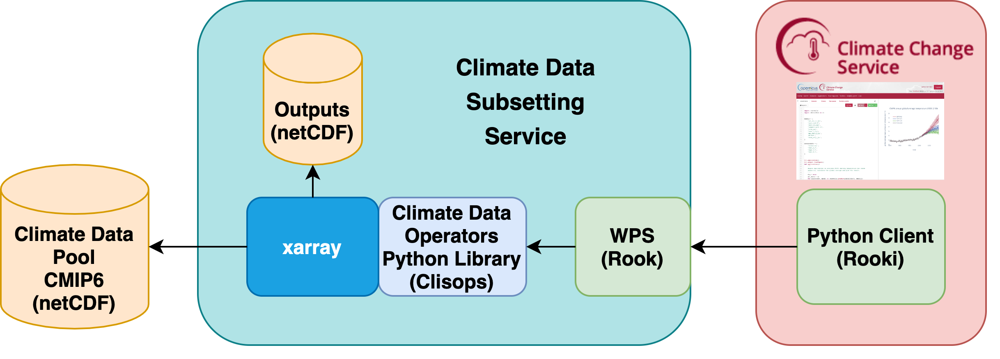

## Rook

A Web Processing Service for the Copernicus Climate Data Store

Carsten Ehbrecht, DKRZ

OGC Member Meeting, 25 March 2021


---
## Rook is a Bird


... but that is another story

```note
bla bla
```
---
## Rook

Remote Operations On Klimadaten

(The K is not a typo)

https://rook-wps.readthedocs.io/en/latest/
---
## What?
... wait
---
## Two days ago
CMIP6 is now live!


---
## Climate Data Store - Download data


---
## Climate Data Store - Toolbox


---
## Climate Data Store - Data?

The climate data is accessed remotely
---
## Remote data access
* Remote data pool for CMIP6, CMIP5, CORDEX
* Load-balanced data servers at three sites (CEDA, IPSL, DKRZ)
* THREDDS Data Server ... but using only file access (not OpenDAP)
---
## Climate data is big
* A single dataset may have several Gigabytes
* But you just want: Temperature, 1990, Africa
---
## Web Processing Service

Call a function remotely
---
## Rook - WPS
* An OGC Web Processing Service
* Using PyWPS - GeoPython
* Providing climate data operators as a service
* Used for data reduction: Temperature, 1990, Africa
---
## Rook - Operators
* Subsetting - time, area, level
* Averaging - over dimensions (time, ...)
* Regridding (a pain!)
* ??? - can be extended
---
## Rook - Clisops
* The Python library implementing these operators
* Using xarray - low level library
* Joint effort together with Ouranos
https://clisops.readthedocs.io/en/latest/
---
## Rooki
* Python WPS client - interactive or as library
* Using OWSLib - GeoPython
* Joint effort with Ouranos (birdy)
* https://rooki.readthedocs.io/en/latest/
---
## Rooki - Notebook

---
## All together

---
## Projects
* Coperniucs C3S: https://climate.copernicus.eu/
* Roocs: https://roocs.github.io/
* Birdhouse: http://bird-house.github.io/
* GeoPython: https://geopython.github.io/
---
## Thanks
Questions?
---
